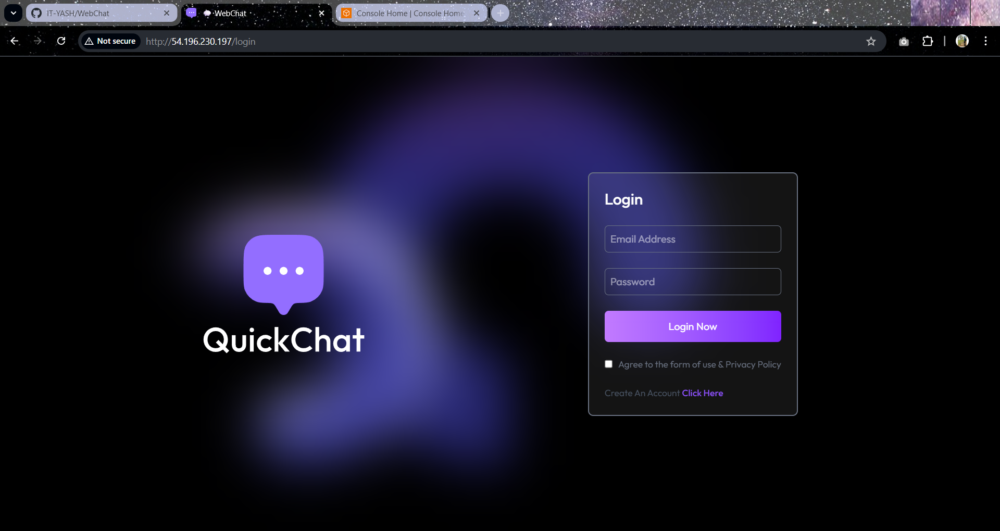
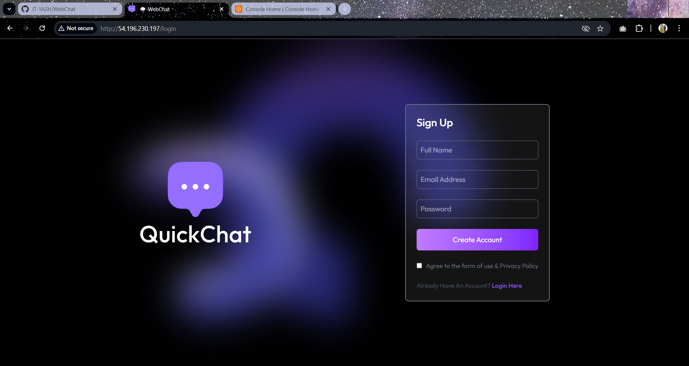
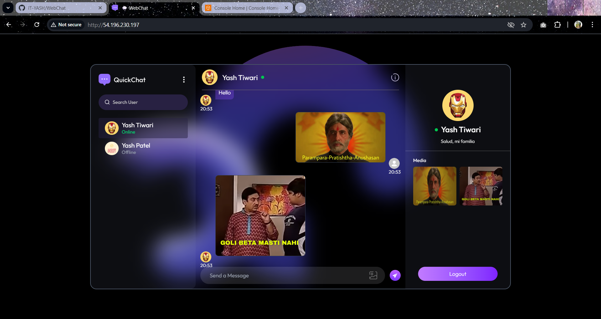
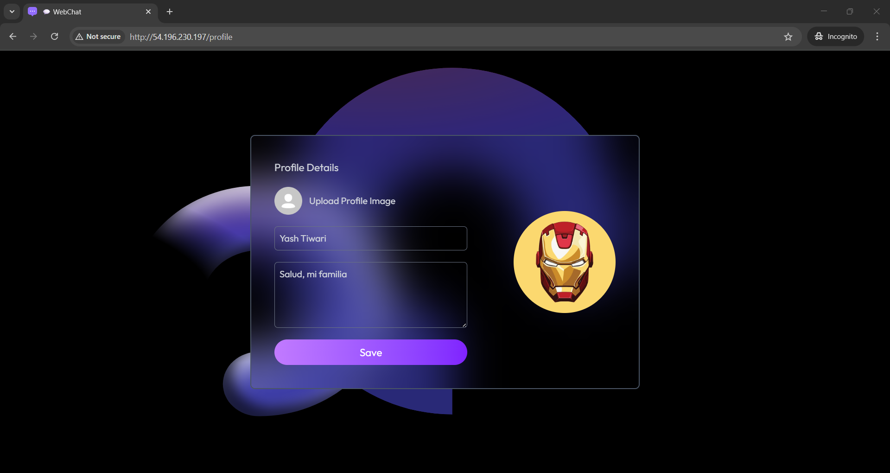

# WebChat - Full Stack Chat Application

  
  

  
  

**WebChat** is a real-time chat application built using **MERN Stack** and deployed on **AWS EC2**. It allows users to sign up, login, and chat with anyone who is registered. Users can share images, search for specific users, and see online/offline statuses in real-time. This project is intended for **learning and testing purposes**, demonstrating both frontend and backend integration, as well as deployment practices on AWS.

---

## 🌟 Key Highlights

- **Real-Time Messaging** using **Socket.io**
- **JWT-based Authentication** for secure login
- **Profile Management** including bio and profile picture
- **User Search & Filtering**
- **Image Sharing** in chat
- **Online/Offline Status Updates**
- **Deployed on AWS EC2** with Nginx serving frontend

---

## 💻 MERN Stack Implementation

**Frontend:**
- Built with **React.js**
- State management with **Context API**
- **Axios** for API calls
- Real-time communication with **Socket.io**
- Responsive UI for desktop and mobile

**Backend:**
- Built with **Node.js** and **Express.js**
- **MongoDB** database for users and messages
- User authentication and JWT token management
- Real-time messaging using **Socket.io**
- Cloudinary integration for image uploads

---

## ☁️ AWS Deployment

**EC2 Instance:**
- Backend server deployed on AWS EC2
- Frontend served via **Nginx**
- Domain/IP accessible publicly

**Security:**
- Configured inbound/outbound **security groups** for ports `22, 80, 443, 5000`
- CORS enabled on backend for frontend communication

**Deployment Steps (Summary):**
1. Install dependencies for backend (`npm install`) and frontend (`npm install`)
2. Configure `.env` for both backend and frontend
3. Build frontend for production (`npm run build`)
4. Copy frontend `dist` to `/var/www/webchat`
5. Configure Nginx to serve frontend and reverse proxy backend
6. Restart Nginx and verify deployment
